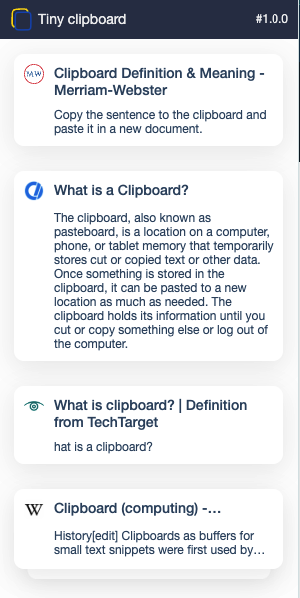
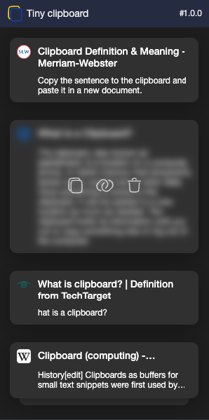

# Tiny clipboard


Tiny clipboard is a browser extension built with Vue, Vite, and TypeScript, designed to help users store and manage their clipboard history conveniently.

## Features

- **Clipboard History:** Automatically saves items copied to the clipboard in local storage.
- **List View:** View a list of clipboard items with options to copy, go to the link, and remove.
- **Convenient Management:** Easily manage your clipboard history directly from the extension popup.

## Screenshots

 


## Installation

1. Clone the repository:

   ```bash
   git clone https://github.com/your-username/your-repo.git
   ```

2. Install dependencies:
   ```bash
   npm install
   ```

3. 
Build the extension:
   ```bash
   npm run build
   ```

## Load the extension in your browser:

### *For Chrome, open chrome://extensions/, enable "Developer mode," and click "Load unpacked." Select the dist folder in your project directory.*
### *For Firefox, open about:debugging#/runtime/this-firefox, click "Load Temporary Add-on," and select the dist/manifest.json file.*

## Usage
Copy any text to the clipboard.
* Click on the icon in your browser.
* Explore and manage your clipboard history.

## Contributing
If you would like to contribute to the project, follow these steps:

Fork the repository.
Create a new branch for your feature or bug fix.
Make your changes and commit them.
Push your changes to your fork.
Open a pull request.

## License
This project is licensed under the MIT.


